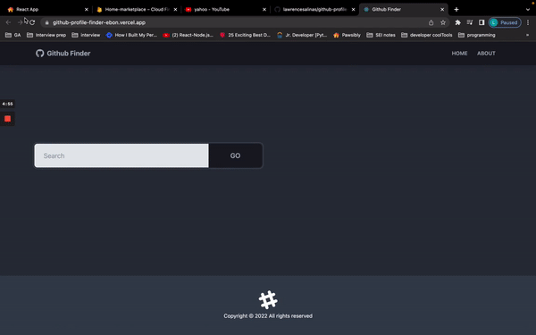

<p align="center">
  
</p>

# Github Profile Finder App

App to search Github users and display their info. Github Profile Finder is a React.js project.
An app that utilizes the Github API for data to search for Github users. uses React hooks to handle and organize components.

## Tech stack

- React, Github API, Tailwind, Bulma

## User flows

As a user, I want to:
- be able to search for github users using a search bar
- view a detailed page of a github user 
- see the github user's no. of followers, no. of public repos, profile Image if available, github profile, location.
- show 10 of the latest repository of the github user


## Usage

Rename **_.env.example_** to **_.env_**

You can use the Github API without a personal token, but if you want to use your token, add it to the .env file

Learn how to create a token [here](https://docs.github.com/en/authentication/keeping-your-account-and-data-secure/creating-a-personal-access-token)

- Fork this repo and in a terminal, clone this repo

```sh
git clone https://github.com/lawrencesalinas/honey-comb-homes.git
```

- Navigate to the repo folder

```sh
cd hooney-comb-homes
```

- Install the project dependencies:

```sh
npm install
```

- Deploy the project on your local machine

```sh
npm start
```

- On your browser, navigate to localhost3000 and the project automatically appears on your locally hosted web page,


## Cloud Deployment

The app repo is  deployed on Vercel [here]https://honey-comb-home.vercel.app/)

## Contributors

- [Lawrence Salinas](https://github.com/lawrencesalinas)


